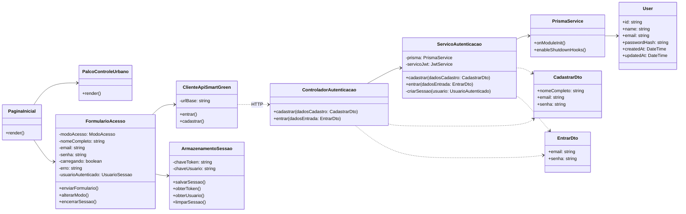
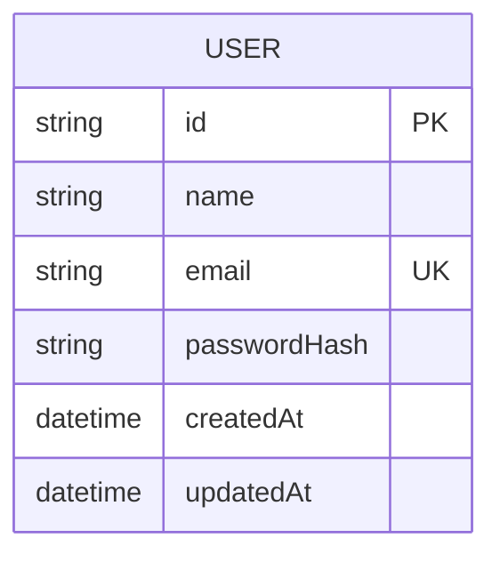
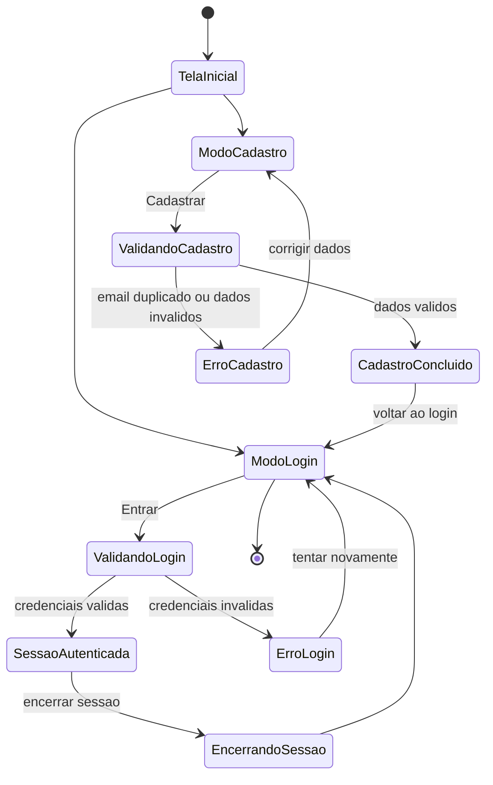

# Diagramas da Sprint 1

Este arquivo consolida os diagramas principais da Sprint 1 do projeto SmartGreen AI.

## Diagrama de Classes

```mermaid
classDiagram
direction LR

class PaginaInicial {
  +render()
}

class PalcoControleUrbano {
  +render()
}

class FormularioAcesso {
  -modoAcesso: ModoAcesso
  -nomeCompleto: string
  -email: string
  -senha: string
  -carregando: boolean
  -erro: string
  -usuarioAutenticado: UsuarioSessao
  +enviarFormulario()
  +alterarModo()
  +encerrarSessao()
}

class ClienteApiSmartGreen {
  -urlBase: string
  +entrar()
  +cadastrar()
}

class ArmazenamentoSessao {
  -chaveToken: string
  -chaveUsuario: string
  +salvarSessao()
  +obterToken()
  +obterUsuario()
  +limparSessao()
}

class ControladorAutenticacao {
  +cadastrar(dadosCadastro: CadastrarDto)
  +entrar(dadosEntrada: EntrarDto)
}

class ServicoAutenticacao {
  -prisma: PrismaService
  -servicoJwt: JwtService
  +cadastrar(dadosCadastro: CadastrarDto)
  +entrar(dadosEntrada: EntrarDto)
  -criarSessao(usuario: UsuarioAutenticado)
}

class PrismaService {
  +onModuleInit()
  +enableShutdownHooks()
}

class CadastrarDto {
  +nomeCompleto: string
  +email: string
  +senha: string
}

class EntrarDto {
  +email: string
  +senha: string
}

class User {
  +id: string
  +name: string
  +email: string
  +passwordHash: string
  +createdAt: DateTime
  +updatedAt: DateTime
}

PaginaInicial --> PalcoControleUrbano
PaginaInicial --> FormularioAcesso
FormularioAcesso --> ClienteApiSmartGreen
FormularioAcesso --> ArmazenamentoSessao
ClienteApiSmartGreen ..> ControladorAutenticacao : HTTP
ControladorAutenticacao --> ServicoAutenticacao
ControladorAutenticacao ..> CadastrarDto
ControladorAutenticacao ..> EntrarDto
ServicoAutenticacao --> PrismaService
ServicoAutenticacao ..> CadastrarDto
ServicoAutenticacao ..> EntrarDto
PrismaService --> User
```

## Diagrama ER

```mermaid
erDiagram
    USER {
        string id PK
        string name
        string email UK
        string passwordHash
        datetime createdAt
        datetime updatedAt
    }
```

## Diagrama de Estados

```mermaid
stateDiagram-v2
    [*] --> TelaInicial

    TelaInicial --> ModoLogin
    TelaInicial --> ModoCadastro

    ModoLogin --> ValidandoLogin : Entrar
    ValidandoLogin --> SessaoAutenticada : credenciais validas
    ValidandoLogin --> ErroLogin : credenciais invalidas
    ErroLogin --> ModoLogin : tentar novamente

    ModoCadastro --> ValidandoCadastro : Cadastrar
    ValidandoCadastro --> CadastroConcluido : dados validos
    ValidandoCadastro --> ErroCadastro : email duplicado ou dados invalidos
    ErroCadastro --> ModoCadastro : corrigir dados

    CadastroConcluido --> ModoLogin : voltar ao login
    SessaoAutenticada --> EncerrandoSessao : encerrar sessao
    EncerrandoSessao --> ModoLogin

    ModoLogin --> [*]
```
