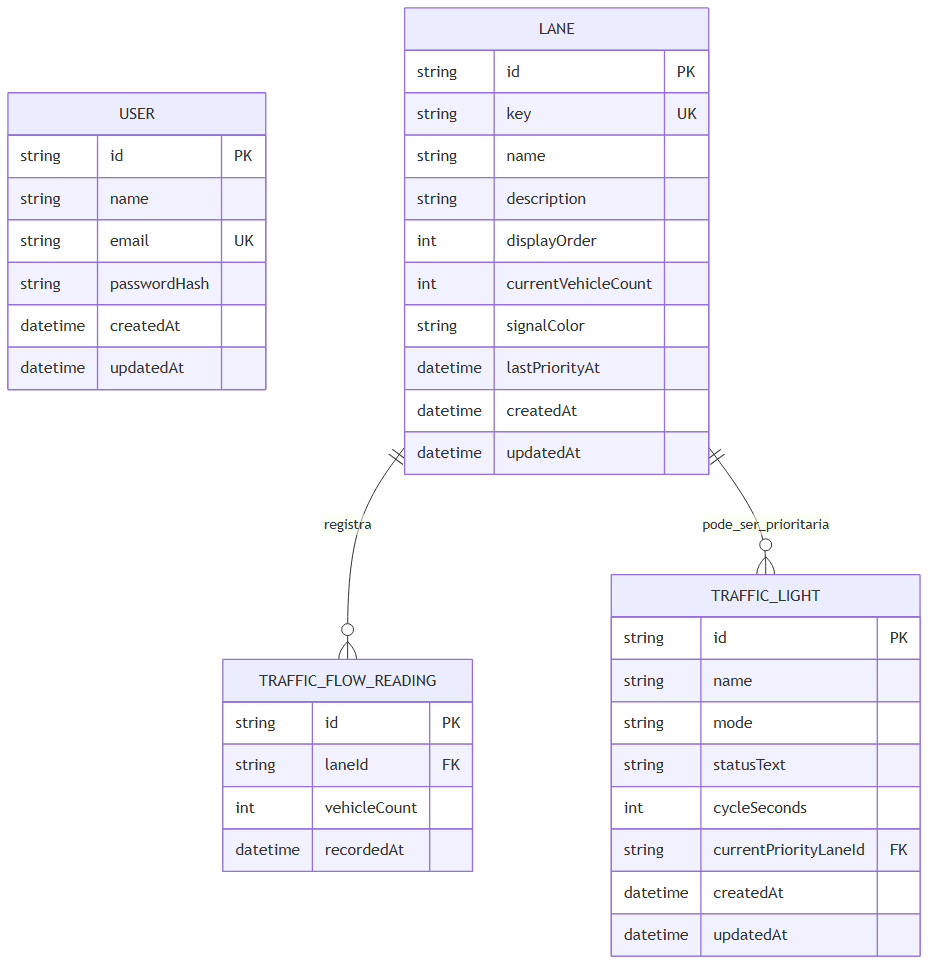
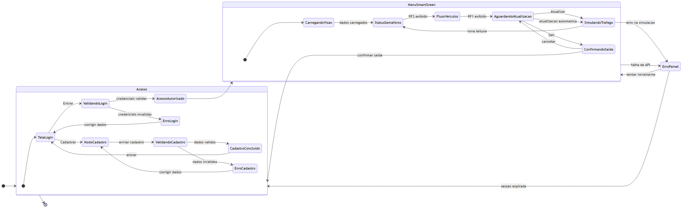
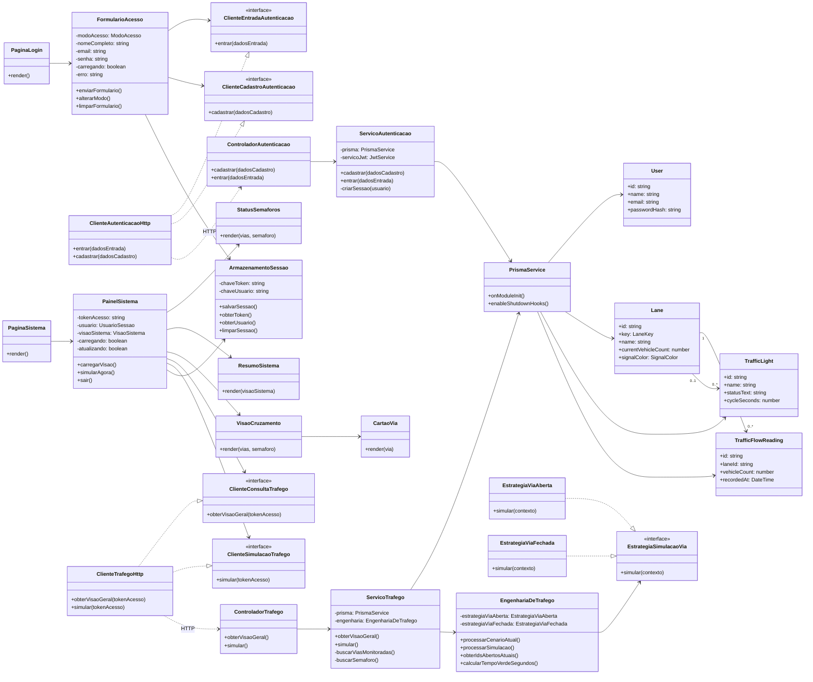
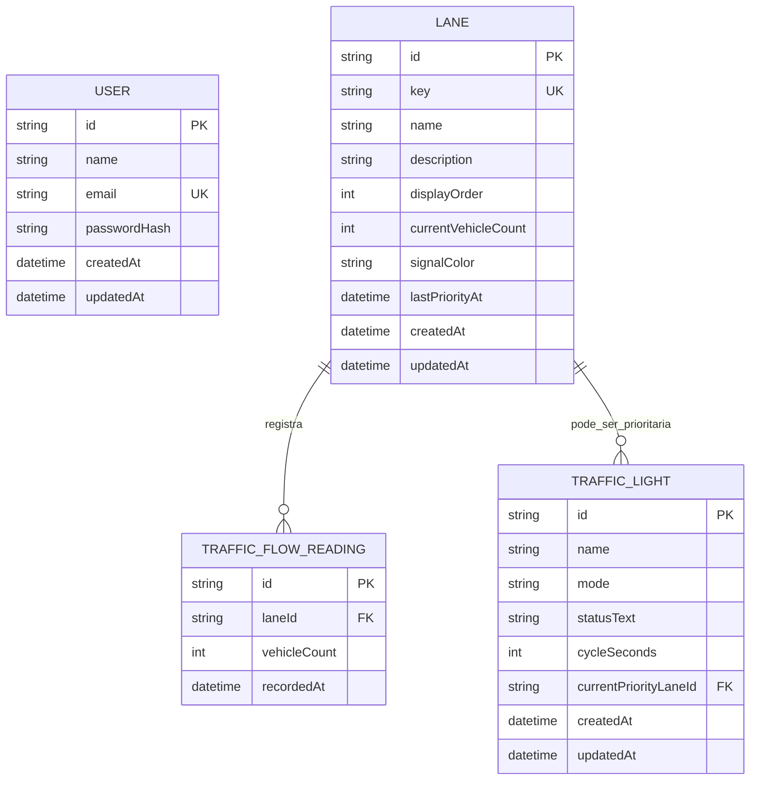
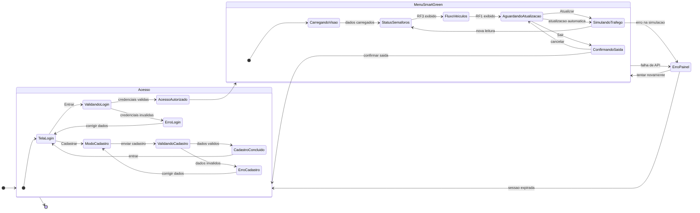

# Diagramas da Sprint 2

Este arquivo consolida os diagramas principais da Sprint 2 do SmartGreen.

A Sprint 2 evolui o sistema da base de autenticacao para o MVP funcional com:

- RF1: monitorar o fluxo de veiculos nas vias do cruzamento;
- RF3: exibir o status atual de cada semaforo no painel;
- melhorias de UX/UI;
- aplicacao de ISP no front-end;
- aplicacao de Strategy Pattern no back-end.

## Imagens Geradas

As imagens PNG prontas para usar na apresentacao estao em:

## Diagrama de Classes

O diagrama de classes mostra a relacao entre tela de login, Menu SmartGreen,
clientes HTTP, controllers, services, Prisma, entidades de banco, ISP e Strategy.

## Diagrama ER

O diagrama entidade-relacionamento mostra a estrutura de dados usada na Sprint 2.

## Diagrama de Estados

O diagrama de estados mostra o fluxo do usuario no sistema, desde login/cadastro
ate o Menu SmartGreen, RF3, RF1, simulacao e saida.

## Como explicar na apresentacao

Use esta fala:

> Na Sprint 2, os diagramas foram atualizados para refletir o MVP funcional. O
> diagrama de classes mostra a separacao entre front-end, clientes HTTP, API,
> services, banco e tambem as refatoracoes com ISP e Strategy. O diagrama ER
> mostra que, alem de usuario, agora temos entidades de trafego: Via, Semaforo e
> Leitura de Fluxo. Ja o diagrama de estados mostra o comportamento do usuario,
> desde login e cadastro ate o Menu SmartGreen, passando por RF3, RF1,
> atualizacao dos dados e saida do sistema.
